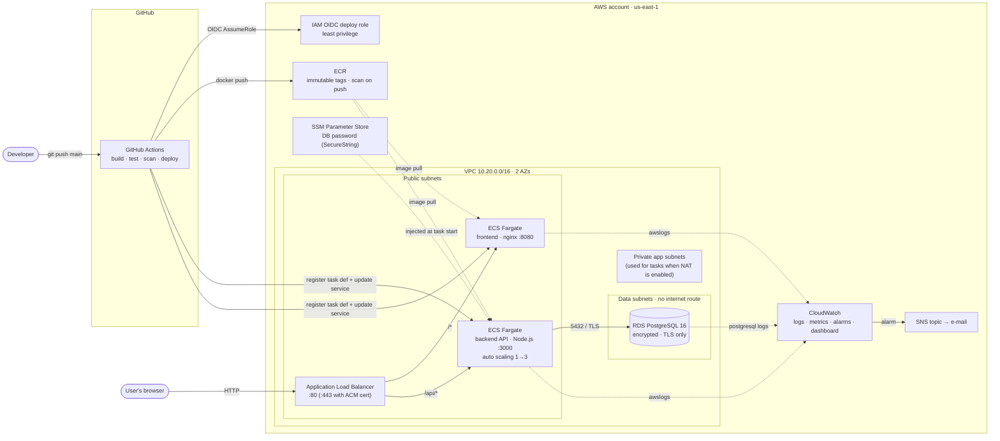

# Three-Tier App on AWS — IaC, Containers & CI/CD

A small three-tier web app (static frontend → REST API → PostgreSQL), deployed on AWS with:

| Area | Implementation |
|---|---|
| Infrastructure as Code | Terraform, seven reusable modules + one environment root, remote S3 state with native locking |
| Compute | ECS Fargate (frontend + backend), Application Load Balancer, CPU target-tracking auto scaling |
| Network | VPC across 2 AZs with public / app / data subnet tiers, SG-to-SG rules only, VPC flow logs |
| Database | RDS PostgreSQL 16, encrypted, private, TLS enforced, password never in Terraform state |
| Containers | Multi-stage, non-root, read-only root FS, all Linux capabilities dropped |
| CI/CD | GitHub Actions: build → test → image build + Trivy scan → push to ECR → rolling deploy to ECS → smoke test |
| Secrets | GitHub OIDC (no AWS keys stored), SSM SecureString for the DB password |
| Observability | Structured JSON logs in CloudWatch, 10+ alarms → SNS, Container Insights, one dashboard |

The application code is deliberately minimal (a messages API and one HTML page). The assessment is about the infrastructure and automation around it.

---

## Contents

1. [Architecture](#1-architecture)
2. [Repository layout](#2-repository-layout)
3. [Run locally](#3-run-locally)
4. [Deploy to AWS](#4-deploy-to-aws)
5. [CI/CD pipeline and secrets](#5-cicd-pipeline-and-secrets)
6. [Security](#6-security)
7. [Monitoring and alerting](#7-monitoring-and-alerting)
8. [Key decisions and rationale](#8-key-decisions-and-rationale)
9. [Trade-offs (time limit and sandbox)](#9-trade-offs-time-limit-and-sandbox)
10. [Sandbox account notes (KodeKloud)](#10-sandbox-account-notes-kodekloud)
11. [Going to production](#11-going-to-production)
12. [Evidence (screenshots)](#12-evidence-screenshots)
13. [Clean-up](#13-clean-up)

---

## 1. Architecture



**Request flow.** The browser talks only to the ALB. `/api/*` goes to the backend target group and everything else to the frontend. Both live on the same origin, so no CORS is needed. The backend is the only thing allowed to reach the database, over TLS.

**Security group chain** (every rule references a security group, never a CIDR, except the public ALB listener):

```
internet ──80/443──▶ alb-sg ──3000──▶ backend-sg ──5432──▶ db-sg
                           └─8080──▶ frontend-sg
```

## 2. Repository layout

```
.
├── app/
│   ├── backend/              Node.js 24 + Express 5 API, tests (node:test), Dockerfile
│   └── frontend/             Static HTML/JS served by unprivileged nginx, Dockerfile
├── docker-compose.yml        Local stack: postgres + backend + frontend
├── infra/
│   ├── bootstrap/            One-time: S3 bucket for Terraform remote state
│   ├── envs/dev/             Environment root: wires modules, tfvars, outputs
│   └── modules/
│       ├── network/          VPC, 3 subnet tiers × 2 AZs, routing, optional NAT, flow logs
│       ├── security/         Security groups (tier-to-tier rules)
│       ├── ecr/              Image repositories + lifecycle policy
│       ├── database/         RDS PostgreSQL, parameter group, SSM password
│       ├── ecs/              Cluster, ALB, task definitions, services, IAM, auto scaling
│       ├── monitoring/       SNS, alarms, log metric filter, dashboard
│       └── github-oidc/      OIDC provider + least-privilege deploy role
└── .github/
    ├── workflows/ci-cd.yml   App pipeline (build → test → image → deploy)
    ├── workflows/infra.yml   Terraform fmt/validate/Checkov; manual plan/apply/destroy
    └── dependabot.yml        Weekly updates: npm, base images, actions, providers
```

**Naming convention:** `<project>-<environment>-<component>`, for example `threetier-dev-alb`, `threetier-dev-backend`, `threetier-dev-postgres`. ECR repositories are `<project>-<environment>/<service>`. SSM parameters are `/<project>-<environment>/...`.

**Tagging convention:** the provider's `default_tags` puts these tags on every taggable resource: `Project`, `Environment`, `Owner`, `CostCenter`, `ManagedBy=terraform`, `Repository`. Resources also get a `Name` tag, and subnets get a `Tier` tag.

## 3. Run locally

Requirements: Docker with Compose v2. Node.js 22+ is only needed to run tests outside Docker.

```bash
docker compose up --build
# open http://localhost:8080
```

Locally, nginx proxies `/api/*` to the backend, which is the same routing the ALB does in AWS. Postgres runs as a container with a throwaway local-only password.

Run the backend tests:

```bash
cd app/backend
npm ci
npm test                                     # or, fully containerised:
docker build --target test app/backend       # the test stage fails the build if a test fails
```

API endpoints: `GET /api/health` (liveness, used by the ALB), `GET /api/ready` (checks the DB), `GET /api/messages`, `POST /api/messages {"text": "..."}`.

## 4. Deploy to AWS

**Prerequisites:** Terraform ≥ 1.11 (CI uses 1.16.5), AWS CLI v2 with credentials for the target account (`aws sts get-caller-identity` must work), and this repository pushed to GitHub.

```bash
# 1. Remote state bucket (once per account)
cd infra/bootstrap
terraform init && terraform apply
terraform output -raw backend_hcl > ../envs/dev/backend.hcl

# 2. Set your repository in infra/envs/dev/terraform.tfvars
#    github_repository = "<github-user>/<repo>"     (+ optional alert_email)

# 3. Provision the environment (~10–15 min, mostly RDS)
cd ../envs/dev
terraform init -backend-config=backend.hcl
terraform plan -out=tfplan
terraform apply tfplan

# 4. Configure GitHub with the (non-secret) outputs - via the gh CLI as below,
#    or by hand in Settings > Secrets and variables > Actions > Variables
terraform output github_actions_variables
gh variable set AWS_REGION          --body "us-east-1"
gh variable set NAME_PREFIX         --body "threetier-dev"
gh variable set AWS_DEPLOY_ROLE_ARN --body "$(terraform output -json github_actions_variables | jq -r .AWS_DEPLOY_ROLE_ARN)"
gh variable set APP_URL             --body "$(terraform output -raw app_url)"

# 5. Deploy the application: push to main (or Actions → CI/CD → Run workflow)
git push origin main

# 6. Open the app
terraform output app_url
```

> **Deploy switch:** the deploy stages only run once the `NAME_PREFIX` repository variable exists. Until then, pushes to `main` build, test and scan without touching AWS.
>
> **First deployment:** Terraform registers the first task definitions with the placeholder tag `bootstrap`, which does not exist in ECR yet. The ECS services stay unhealthy until the pipeline pushes the first real images (step 5). This is expected. After that, every push to `main` builds and deploys automatically.

**Without OIDC (for example in a restricted sandbox):** set `enable_github_oidc = false` in `terraform.tfvars`, leave `AWS_DEPLOY_ROLE_ARN` unset, and store the access keys as repository **secrets**: `AWS_ACCESS_KEY_ID`, `AWS_SECRET_ACCESS_KEY` and, if temporary, `AWS_SESSION_TOKEN`. The workflows pick the method automatically.

**Infrastructure from CI:** after the bootstrap step, set `TF_STATE_BUCKET` as a repository variable. Then *Actions → Terraform → Run workflow* runs `plan`, `apply` or `destroy`.

## 5. CI/CD pipeline and secrets

### Application pipeline: [`.github/workflows/ci-cd.yml`](.github/workflows/ci-cd.yml)

```
push to main ─▶ build-test ─▶ image (matrix: backend, frontend) ─▶ deploy (matrix) ─▶ smoke-test
pull request ─▶ build-test ─▶ image (build + scan only, no AWS access)
```

| Stage | What it does |
|---|---|
| **Build & test** | `npm ci` (lockfile-exact), syntax check, unit tests, `npm audit` for high-severity issues in production dependencies |
| **Image** | Buildx with GitHub Actions layer cache, then a Trivy scan that **fails on fixable CRITICAL CVEs**. On `main` only: push to ECR, tagged with the commit SHA (tags are immutable) |
| **Deploy** | Downloads the task definition Terraform registered, swaps in the new image (`amazon-ecs-render-task-definition`), registers it, and updates the service. Waits for stability. The ECS deployment circuit breaker rolls back automatically if the new tasks never become healthy |
| **Smoke test** | Calls `/healthz`, `/api/health` and `/api/ready` through the ALB and checks that the running version equals the commit SHA |

Concurrency control: PR runs that are superseded get cancelled, but deployments to `main` are never cancelled half-way.

### Infrastructure pipeline: [`.github/workflows/infra.yml`](.github/workflows/infra.yml)

Every push and PR touching `infra/` runs `terraform fmt -check`, `terraform validate` on every root, and a Checkov IaC security scan. `plan` / `apply` / `destroy` run only when triggered manually through `workflow_dispatch`, inside the `dev` environment (which can require a reviewer). Infrastructure changes are deliberately reviewed as a plan first, while application deploys are fully automatic.

### How secrets are handled (nothing is hard-coded)

| Secret | Where it lives | How it is consumed |
|---|---|---|
| AWS credentials for CI | **None stored.** GitHub's OIDC token is exchanged for 1-hour STS credentials (`AWS_DEPLOY_ROLE_ARN` is a non-secret *variable*). The role trust policy only accepts this repository's `main` branch or `dev` environment, so pull requests and forks can't assume it | `aws-actions/configure-aws-credentials` |
| Fallback sandbox keys | GitHub encrypted **secrets** (masked in logs), used only if OIDC is unavailable | same action |
| Database password | Generated by an **ephemeral** `random_password` and written through **write-only** arguments (`password_wo`, `value_wo`), so it is **never in the Terraform plan or state**. Stored as an SSM `SecureString` (KMS-encrypted) | The ECS agent injects it as `DB_PASSWORD` at task start. The execution role may read that one parameter only |
| Non-secret config | GitHub repository *variables* and Terraform outputs | — |

The local `docker-compose.yml` uses a throwaway local-only password that is never used in AWS. `.gitignore` excludes state files, `backend.hcl` and `.env` files.

## 6. Security

- **Least-privilege IAM**
  - *Task execution role:* a custom inline policy instead of the broad `AmazonECSTaskExecutionRolePolicy`. It can pull from the two ECR repositories, write to the two log groups and read one SSM parameter. Its trust policy is limited to `aws:SourceAccount`.
  - *Task role:* no permissions, because the app calls no AWS APIs.
  - *CI deploy role:* push to the two repositories, update the two services, and `iam:PassRole` on only the two ECS roles, conditioned on `ecs-tasks.amazonaws.com`. Wildcards only where AWS doesn't support resource-level permissions (`ecr:GetAuthorizationToken`, `ecs:RegisterTaskDefinition`).
- **Network**
  - Only the ALB is reachable from the internet (port 80, plus 443 when a certificate is configured).
  - Tasks accept traffic only from the ALB security group. The database accepts traffic only from the backend security group and has no egress rules.
  - Database subnets have no internet route, and RDS is `publicly_accessible = false`.
  - The VPC default security group is stripped of all rules.
  - Rejected traffic is logged through VPC flow logs.
- **Encryption**
  - In transit: the backend verifies the database certificate against the AWS RDS CA bundle baked into the image, and the parameter group sets `rds.force_ssl = 1`. HTTPS on the ALB uses a TLS 1.3 policy once an ACM certificate is provided.
  - At rest: RDS storage (KMS), SSM SecureString, the SNS topic (`alias/aws/sns`), ECR (AES-256) and the Terraform state bucket (SSE-KMS, versioned, public access blocked, TLS-only bucket policy).
- **Containers**
  - Run as non-root (`node` uid 1000, nginx uid 101) with a read-only root filesystem and all Linux capabilities dropped.
  - npm/yarn/corepack are removed from the runtime image.
  - The ALB drops invalid headers, and nginx sends security headers (CSP, `X-Frame-Options`, `nosniff`).
- **Supply chain:** immutable ECR tags, scan on push, Trivy gate in CI, Checkov on Terraform, Dependabot for every ecosystem, and a committed provider lock file.

## 7. Monitoring and alerting

- **Logs.** Backend logs are structured JSON (one line per request, with method, path, status and duration_ms), so CloudWatch Logs Insights can query fields directly. Log groups: `/ecs/threetier-dev/{backend,frontend}`, `/vpc/threetier-dev/flow-logs`, and the RDS `postgresql` log export (slow queries over 500 ms and connections). Retention is 14 days.
- **Metrics.** Container Insights is enabled on the cluster, plus the standard ALB, ECS and RDS metrics.
- **Dashboard.** `threetier-dev-overview` shows requests and 4xx/5xx counts, p50/p95 latency, ECS CPU/memory, RDS CPU and connections, and a live table of recent backend errors.
- **Alarms.** All alarms notify the SNS topic `threetier-dev-alerts`. Set `alert_email` to get e-mails; AWS sends a confirmation link first.

| Alarm | Condition |
|---|---|
| `backend-error-logs` (example log-based alarm) | ≥ 1 log line with `"level":"error"` in 5 min, via a metric filter `{ $.level = "error" }` |
| `alb-target-5xx` | > 5 target 5xx responses in 5 min |
| `<service>-unhealthy-targets` | any target failing health checks for 3 min |
| `alb-latency-p95` | p95 response time > 1 s for 10 min |
| `<service>-cpu-high` / `-memory-high` | > 80 % for 10 min |
| `rds-cpu-high` / `rds-free-storage-low` | > 80 % CPU / < 2 GiB free |

**Testing the example alert:** stop the RDS instance, or temporarily change the backend's `DB_HOST`. Calls to `/api/ready` then log `"level":"error"`, and `backend-error-logs` goes to ALARM within about 5 minutes.

## 8. Key decisions and rationale

| Decision | Why |
|---|---|
| **AWS** | The most widely used provider, the most mature Terraform provider, and a sandbox (KodeKloud) was available for a no-cost deployment |
| **Terraform** with small modules + a thin environment root | Each module has one responsibility and explicit inputs/outputs. Adding `staging`/`prod` means a new `envs/<name>` folder with different tfvars, not copy-pasted resources |
| **ECS Fargate** (not EC2, EKS or Lambda) | No servers to patch, container-native, and integrates directly with ALB, IAM and CloudWatch. EKS would add a control plane ($73/month) and operational overhead that two services don't justify. Lambda would need app changes and handles long-lived DB connections poorly |
| **Frontend as an nginx container behind the same ALB** (not S3 + CloudFront) | One entry point, same-origin API (no CORS), and both tiers go through the same build/scan/deploy pipeline. CloudFront is often restricted in sandbox accounts. For production, S3 + CloudFront would be the better choice for a pure static site (see §11) |
| **RDS PostgreSQL** | A managed database with backups, patching, encryption and log export built in |
| **Terraform owns infra and task-definition shape; the pipeline owns the image version** (`ignore_changes = [task_definition]`) | App deploys take about 2 minutes and need no Terraform permissions, and Terraform never rolls an image back to an old tag |
| **Password via ephemeral resource + write-only arguments** | Keeps the secret out of state entirely, which matters because state is readable by anyone with access to the bucket |
| **S3-native state locking** (`use_lockfile`) | No DynamoDB table to manage (Terraform ≥ 1.10) |
| **Separate liveness (`/api/health`) and readiness (`/api/ready`) endpoints** | The ALB doesn't kill healthy API containers during a short database outage, while the dependency is still observable |

## 9. Trade-offs (time limit and sandbox)

| Trade-off | Impact | Production fix |
|---|---|---|
| No NAT gateway by default, so tasks run in public subnets with a public IP | Tasks are still unreachable except through the ALB security group, but they have a public address | Set `enable_nat_gateway = true` (already supported: tasks move to the private app subnets automatically) or add VPC endpoints for ECR, Logs and SSM |
| HTTP only (no domain or ACM certificate in the sandbox) | Traffic between the browser and the ALB is unencrypted | Set `certificate_arn`: HTTPS with a TLS 1.3 policy and an HTTP→HTTPS redirect are already wired |
| Single-AZ `db.t3.micro`, 1-day backups, no deletion protection in `dev` | No database failover | `db_multi_az = true`, a larger instance and longer retention. `deletion_protection` and the final snapshot switch on automatically for `prod` |
| The API connects as the RDS master user | Broader DB privileges than needed | Dedicated app role with only DML rights. Secrets Manager rotation or IAM DB authentication |
| Schema created at app start-up (`CREATE TABLE IF NOT EXISTS`) | Fine for one table | A migration tool (Flyway or node-pg-migrate) run as a one-off ECS task before deploying |
| Terraform changes to a task definition (env vars, sizing) are only picked up by the next app deploy | Expected with split ownership | Documented. A deploy can be triggered with *Run workflow* |
| No WAF, ALB access logs, GuardDuty or CloudTrail setup | Less visibility and protection at the edge | These are usually account-level baselines; add AWS WAF managed rules on the ALB |
| Base images pinned by tag, not digest | A tag could change underneath the build | Pin by digest; Dependabot already proposes updates |
| No end-to-end/integration tests in the pipeline | The unit tests use an in-memory fake DB | Add a compose-based integration job and a post-deploy synthetic check (CloudWatch Synthetics) |

## 10. Sandbox account notes (KodeKloud)

This project was deployed to a **KodeKloud AWS playground**, a temporary sandbox account, instead of a personal free-tier account. What that means:

- The account is **short-lived** (the session expires and all resources are wiped), so the deployment was captured with screenshots (§12) and does not remain running.
- Playgrounds allow only some services, regions and instance sizes. Defaults were chosen to fit: `us-east-1`, `db.t3.micro`, Fargate 0.25 vCPU / 0.5 GB, no NAT gateway, no CloudFront, no Secrets Manager.
- If the playground doesn't allow creating an IAM OIDC provider, set `enable_github_oidc = false` and use the playground's temporary keys as GitHub secrets (see §4). If Container Insights or flow logs are blocked, set `enable_container_insights = false` / `enable_flow_logs = false`.
- Some playgrounds deny more actions. Each switch below skips only the resource that needs the denied action, and the defaults keep the full setup. `infra/envs/dev/terraform.tfvars` sets all of them for the KodeKloud AWS playground:

  | Denied action | Switch | Effect |
  |---|---|---|
  | `rds:CreateDBParameterGroup` | `db_create_parameter_group = false` | AWS default group; PostgreSQL 16 still forces TLS, but there's no slow-query or connection logging |
  | `logs:PutRetentionPolicy` | `log_retention_days = 0` | Log groups never expire |
  | `application-autoscaling:TagResource` | `enable_autoscaling = false` | Backend runs at a fixed task count |
  | `logs:PutMetricFilter` | `enable_log_metric_alarm = false` | No log-based error alarm (the metric alarms remain) |
  | `iam:TagPolicy` | `tag_iam_policies = false` | The IAM policies are created untagged |
  | `ec2:CreateFlowLogs` | `enable_flow_logs = false` | No VPC flow logs |

- IAM policies are customer-managed and attached to roles, not inline, because playgrounds allow `iam:AttachRolePolicy` but not `iam:PutRolePolicy`. The playground doesn't allow `iam:DeletePolicy` or `logs:DeleteLogGroup`, so `terraform destroy` can leave those behind. They disappear when the session ends.
- ECR repositories and the state bucket use `force_delete` / `force_destroy` in `dev`, so `terraform destroy` cleans up completely before the session ends.

**Approximate cost** if run in a normal account (us-east-1, 24/7): ALB ~$17, 2 Fargate tasks ~$18, RDS `db.t3.micro` + 20 GB ~$15, public IPv4 addresses (ALB + tasks) ~$15, CloudWatch ~$5. Total **≈ $70/month**, or about **$0.10/hour**. A 2-hour sandbox demo costs a few cents.

## 11. Going to production

**High availability.** Run at least 2 tasks per service across 3 AZs, with the tasks in private subnets behind a NAT gateway in each AZ (or VPC endpoints). Use RDS Multi-AZ (or Aurora PostgreSQL with a reader replica), plus deletion protection, 7–35 days of backups and point-in-time recovery. Put the static frontend on S3 + CloudFront, and add Route 53 health checks. Disaster recovery: cross-region snapshot copies and Terraform able to rebuild the stack in a second region.

**Scale.** CPU target tracking is already in place; add request-count-per-target scaling, scheduled scaling for known peaks, and RDS Proxy for connection pooling. Add read replicas or ElastiCache for read-heavy traffic and CloudFront caching at the edge. Move to Aurora Serverless v2 if load is spiky.

**Security and operations.** Separate AWS accounts per environment (AWS Organizations + SSO). HTTPS everywhere with WAF managed rules. GuardDuty, Security Hub, CloudTrail, AWS Config. Secrets Manager with rotation and a dedicated least-privilege DB user. Customer-managed KMS keys. Images pinned by digest and signed. Promotion of the same image `dev → staging → prod` with a manual approval gate, and blue/green deployments with CodeDeploy for instant rollback. Alarms routed to PagerDuty or Slack with runbooks, plus SLOs and X-Ray/OpenTelemetry tracing.

**Cost.** Fargate Spot for non-critical or dev workloads. Compute Savings Plans and RDS Reserved Instances for the steady baseline. Graviton (ARM64) tasks and instances, about 20 % cheaper. VPC endpoints to cut NAT data-processing charges. Log retention tuned per log group. Non-prod environments scheduled to scale to zero outside working hours. AWS Budgets alerts per `Environment`/`CostCenter` tag.

## 12. Evidence (screenshots)

Screenshots are stored in [`docs/screenshots/`](docs/screenshots/):

| # | What it shows | File |
|---|---|---|
| 1 | `terraform apply` completing, with outputs | `01-terraform-apply.png` |
| 2 | GitHub Actions run: all jobs green on `main` | `02-pipeline.png` |
| 3 | The app in the browser through the ALB URL (API and DB status green) | `03-app.png` |
| 4 | ECS services running, with healthy targets | `04-ecs-services.png` |
| 5 | CloudWatch dashboard | `05-dashboard.png` |
| 6 | CloudWatch alarms list (and an alarm in ALARM state if triggered) | `06-alarms.png` |
| 7 | Backend JSON logs in CloudWatch Logs Insights | `07-logs.png` |
| 8 | `terraform destroy`: not captured. The KodeKloud session was ended instead, which deletes the whole sandbox account | — |
| 1b | `terraform apply` refreshing the deployed resources (VPC, subnets, security groups, …) | `01b-terraform-refresh.png` |
| 7b | CloudWatch log groups: ECS, RDS PostgreSQL export, Container Insights | `07b-log-groups.png` |
| 4b | Backend deployment: timeline, circuit breaker with 0 failed tasks | `04b-ecs-backend-deployment.png` |
| 9 | ECR repositories: immutable tags, AES-256 encryption | `09-ecr-repositories.png` |
| 10 | Pipeline job summary: image pushed to ECR, tagged with the commit SHA | `10-image-pushed.png` |
| 11 | Terraform workflow: fmt, validate and Checkov scan passing | `11-infra-pipeline.png` |
| — | First pipeline run: the backend deploy step timed out because a manual redeploy (DB password rotation) overlapped its wait; the deployment itself succeeded | `02-pipeline-first-run.png` |

## 13. Clean-up

```bash
cd infra/envs/dev && terraform destroy
cd ../../bootstrap && terraform destroy
```
